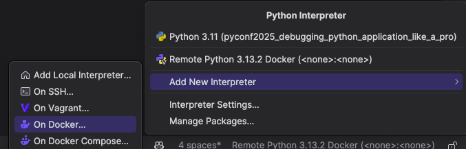
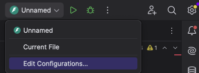

# Debugging Containers in PyCharm

---

### Adding a Remote Interpreter

1. **Open Interpreter Settings**: Click on "Add New Interpreter" located on the bottom right bar of PyCharm.
2. **Select Docker**: Choose "On Docker" from the options.
3. **Configure Docker**: Select your Docker file and context folder.
   - If required, provide additional options like tags and other variables.
4. **Finalize Setup**: Click "Next" to create and inspect a Docker container.

---

### Adding Debugging Configuration

1. **Use Remote Interpreter**: Ensure you have set up the remote interpreter from the previous step.
2. **Edit Configurations**: Go to the Debug tab and select "Edit Configurations."
3. **Add New Configuration**: Click to add a new configuration and Choose the appropriate module or requirements (e.g., FastAPI, Flask, Django, Script).
4. **Docker Configuration**: The Docker configuration will automatically be added to the debugging configuration.
5. **Save and Debug**: Save the configuration and click "Debug". PyCharm will start a new Docker container and attach the debugger to it (PyCharm uses Pydevd).

---

# Questions?

Thank you!
