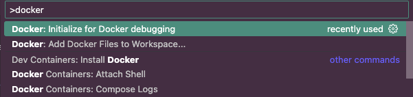

<style>
section {
   font-size: 27px;
}
</style>

# Container Debugging in Visual Studio Code

### Introduction

Debugging applications running inside containers can be challenging. Visual Studio Code provides powerful tools to simplify this process, allowing you to debug your applications as if they were running locally.

---

<style scoped>
section {
   font-size: 22px;
}
</style>

## Remote Debugging (Manual)


1. **Install Debugging Tools**: 
   - Use `pip install ptvsd` or `pip install debugpy` to install the necessary packages for remote debugging.

2. **Configure the Target Application**:
   - Modify your Python application to include the following code snippet to enable remote debugging:
     ```python
     import debugpy
     debugpy.listen(("0.0.0.0", 5678))
     print("Waiting for debugger attach...")
     debugpy.wait_for_client()
     ```
   - Ensure your application is running inside the container with the above configuration.

3. **Attach to the Remote Debugger in VS Code**:
   - Open the Command Palette (`Ctrl+Shift+P` or `Cmd+Shift+P` on macOS) and select `Debug: Attach to Process`.
   - Enter the IP address and port (e.g., `localhost:5678`) to connect to the debugger.

---

<style scoped>
section {
   font-size: 22px;
}
</style>

### Remote Debugging with Configurations

1. **Initialize Docker for Debugging**:
   - Go to settings and select `Docker: Initialize for Debugging`.
2. **Select Module Type**:
   - Choose the type of module you want to debug (e.g., Python, Node.js) and fill in the required details.
3. **Configure Docker Tasks**:
   - This will automatically add Docker build and run tasks to your project and create a launch configuration in `.vscode/launch.json`.
4. **Start Debugging**:
   - Click on the debug icon in the Activity Bar, select the appropriate configuration, and start debugging your containerized application.



---

<style scoped>
section {
   font-size: 24px;
}
</style>

# Summary

### Key Takeaways
- **Configure Debugging**: Set up debugging for simple scripts, Django, and Flask applications.
- **Utilize VS Code’s Debugging Tools**:
  - Set breakpoints to pause execution and inspect variables.
  - Attach to running processes for real-time debugging.
  - Debug across different environments seamlessly.
- **Streamline Python Debugging**: Efficiently debug Python applications both locally and remotely using VS Code.

---

# Questions?

Thank you!