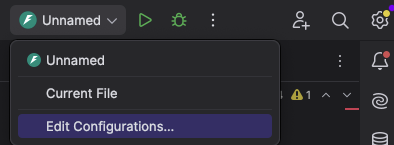

# Debugging in Visual Studio Code

### Overview
- Configure debugging for various project types.
- Utilize PyCharms’s debugging interface effectively.
- Debug Python applications in diverse environments.

Reference Document: [Python Debugging in Pycharm](https://www.jetbrains.com/pycharm/features/debugger.html)

---

# Configuring Debugging

### Simple Scripts
1. Open your Project in PyCharm.
2. Select your interpreter (Pycharm automatically detects).
2. Open your script and go to run/debug configurations and select `current file`.
3. Click on Debugger logo.

---

### Creating launch configurations

1. Go to debugger toolbar and in dropdown select `Edit Configurations`.
2. Choose Type of configuration you would like to select.
3. Fill in the required details and save.
4. Click on debugger logo to start debugger.

---

### FastAPI or Djago or Flask Applications

1. Select Python interpreter for your project ( Virtual Environment )
2. Ensure your app’s dependencies are installed.
3. Select approriate debugging configuration.
4. Click on debugger logo to start debugging.

---

# PyCharms’s Debugging Interface

### Key Features
- **Breakpoints**: Pause execution at specific lines.
- **Variables**: Inspect variable states dynamically.
- **Call Stack**: Navigate the order of function calls.
- **Watch**: Monitor expressions in real-time.
- **Debug Console**: Execute commands during debugging.

---

### Setting Breakpoints
1. Click in the margin next to a line number.
2. Conditional breakpoints:
   - Right-click a breakpoint.
   - Add conditions like `x > 5`.

---

# Summary

### Key Takeaways
- Configure debugging for simple scripts, Django, and Flask.
- Utilize PyCharm’s debugging tools:
  - Breakpoints
  - Attach to processes
  - Debug across environments.
- Streamline Python debugging locally and remotely.

---

# Questions?

Thank you!
